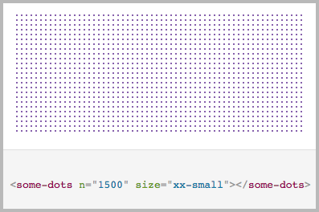

# \<some-dots\>

A custom-element to create many fancy dots.



## Watch the demo:

https://franciscogutierrez.github.io/some-dots/components/some-dots/demo/

## Install

Install it using bower:

```bash
$ bower install some-dots --save
```

## Usage

Import the custom element:

```html
<link rel="import" href="bower_components/some-dots/some-dots.html">
```
Then you can use it:

```html
<some-dots></some-dots>
```

Please look at the [documentation](https://franciscogutierrez.github.io/some-dots/components/some-dots/demo/) for more options.
